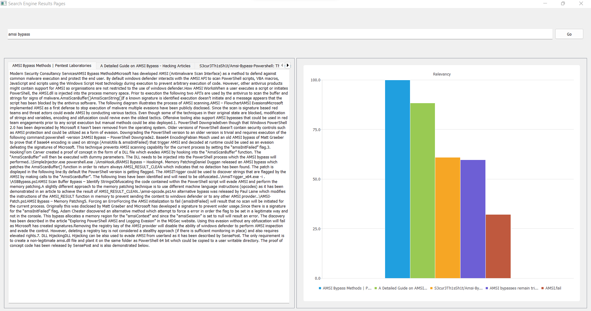

Search Engine Results Pages (SERP) are the pages displayed by search engines in response to a query by a user. Each result displayed normally includes a title, a link that points to the actual page on the Web, and a short description showing where the keywords have matched content within the page for organic results. The SERP are ranked based on relevance for organic results. Considering the semantic search of users’ query gives more accurate SERP. More importantly, summarizing the relevant content of SERP for users instead of the displayed titles and links will be more useful to users.
Design and implement a multithreaded program for returning summarized relevant content of SERP and ranked each summary in order of relevance. Your implementation should also include visualization of your results.

